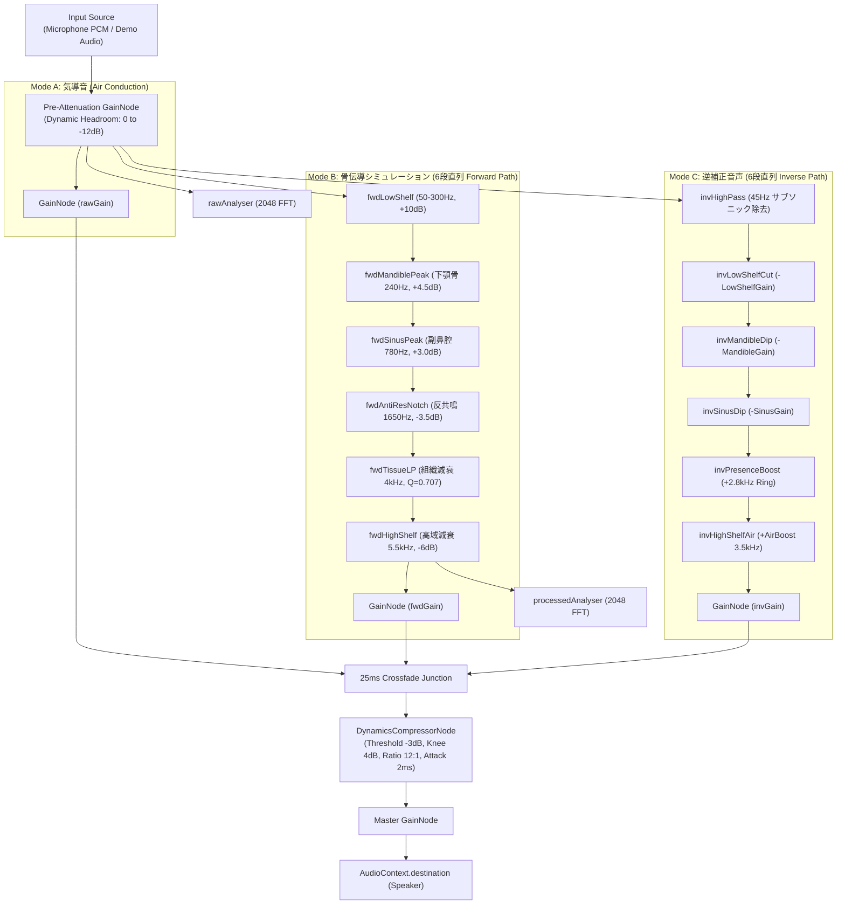
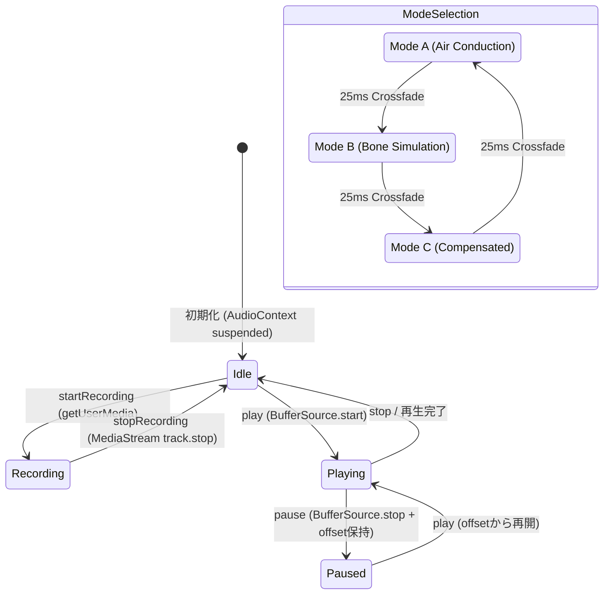

# 🏛️ VocalMirror Architecture Specification (v0.1.0)

本ドキュメントは、VocalMirror の音響信号処理（DSP）、ビジュライザー、多言語化（i18n）、および状態管理の内部アーキテクチャ詳細を規定する技術仕様書です。

---

## 1. 音響生理学と双方向 DSP パイプライン

### 1.1 音声対面現象（Voice Confrontation）の伝達モデル

人間が自己の発声を知覚する経路は、**気導音伝達系 \(H_{\text{air}}(\omega)\)** と **骨伝導伝達系 \(H_{\text{bone}}(\omega)\)** の和として定式化されます：

\[
S_{\text{internal}}(\omega) = S_{\text{vocal}}(\omega) \cdot \left[ H_{\text{air}}(\omega) + H_{\text{bone}}(\omega) \right]
\]

ここで、録音マイクが捉えるのは外耳道を介さない純粋な気導音 \(S_{\text{external}}(\omega) = S_{\text{vocal}}(\omega) \cdot H_{\text{air}}(\omega)\) のみであるため、骨伝導による低域増強（+6〜+14dB）と高域減衰（-12dB以上）が欠落し、自己知覚との乖離（音声対面現象）が発生します。

---

### 1.2 Web Audio API ノードグラフ



---

## 2. フィルタ数学と動的ヘッドルーム設計

### 2.1 RBJ Audio EQ Cookbook 準拠の Biquad 係数計算
すべての Biquad フィルタは `biquadMath.ts` において Robert Bristow-Johnson (RBJ) の Audio EQ Cookbook に完全準拠して実装されています。

- **角周波数**: \(\omega_0 = 2\pi \frac{f_0}{F_s}\)
- **中間変数**: \(\alpha = \frac{\sin(\omega_0)}{2Q}\), \(A = 10^{\frac{G_{\text{dB}}}{40}}\), \(\beta = \sqrt{A} \cdot \sin(\omega_0)\)

### 2.2 動的プリ減衰アルゴリズム（クリッピング完全防止）
低域シェルフや共鳴ピークを大幅にブースト（最大 +14dB）しても 0dBFS を超えてクリッピングしないよう、設定されたゲイン量に応じて入力段で動的にヘッドルームを確保します：

```typescript
export function calculateDynamicPreAttenuation(params: DspParameters): number {
  const boostSum =
    Math.max(0, params.lowShelfGain) +
    0.6 * Math.max(0, params.mandibleResGain) +
    0.4 * Math.max(0, params.sinusResGain);

  const scaleFactor = 0.75;
  const rawAttenDb = boostSum * scaleFactor;
  const clampedDb = Math.min(
    AUDIO_CONSTANTS.DYNAMIC_HEADROOM_MAX_ATTEN_DB, // 12.0 dB
    Math.max(AUDIO_CONSTANTS.DYNAMIC_HEADROOM_MIN_ATTEN_DB, rawAttenDb) // 3.0 dB
  );
  return Math.pow(10, -clampedDb / 20);
}
```

---

## 3. 60fps ゼロアロケーション Canvas 2D レンダラー

### 3.1 ガベージコレクション (GC) 停止の完全排除
毎フレーム（60fps）のアロケーション（`new Float32Array`, オブジェクト生成）は GC による画面のカクつき（Jank）を引き起こすため、すべての描画バッファは初期化時に事前確保されます：

| 事前確保バッファ | サイズ | 用途 |
| :--- | :--- | :--- |
| `rawFreqData` / `boneFreqData` | 2048 (Float32Array) | AnalyserNode からの生デシベルデータ |
| `pixelAirY` / `pixelBoneY` | 4096 (Float32Array) | 画面ピクセル X 座標に対応する Y 座標 |
| `smoothedAirY` / `smoothedBoneY` | 4096 (Float32Array) | 指数移動平均（EMA）スムージング済み座標 |

### 3.2 対数周波数マッピングと FFT ビン線形補間
低域（50〜400Hz）の解像度を最大化するため、20Hz〜20kHz を対数スケールで X 座標へ射影します：

\[
\text{normX} = \frac{\log_{10}(f) - \log_{10}(f_{\min})}{\log_{10}(f_{\max}) - \log_{10}(f_{\min})}
\]

離散的な FFT ビンに対しては、浮動小数点ビンインデックス \(b = \frac{f \cdot N_{\text{FFT}}}{F_s}\) を求め、前後2ビン間で線形補間（`interpolateMagnitude`）を行うことで、滑らかなスペクトル曲線を生成します。

---

## 4. ゼロ依存型安全 i18n アーキテクチャ

### 4.1 レイヤー構造
```
src/i18n/
├── types.ts          # 辞書構造の厳格な TypeScript 型定義 (TranslationDictionary)
├── interpolate.ts    # テンプレート文字列置換 (ゼロ依存, RegExp-based)
├── locales/
│   ├── en.ts         # 英語マスター辞書 (SSOT)
│   └── ja.ts         # 日本語マスター辞書 (100% キー対称性)
├── LanguageContext.tsx # React Context, Provider, useTranslation, useLanguage
└── index.ts          # バレルエクスポート
```

### 4.2 特徴
1. **型推論によるコンパイル時キー保証**: TypeScript の strict mode により、タイポや未定義キーへのアクセスはビルドエラーとなります。
2. **自動整合性テスト**: `tests/unit/i18n/i18nKeySync.test.ts` が `en.ts` と `ja.ts` の全キーを再帰走査し、キーの欠落・孤立が 0 件であることを機械的に保証します。
3. **Canvas レンダラーとの疎結合**: Canvas 2D クラス (`SpectrumVisualizerRenderer`) は React に依存せず、オプション引数 `labelFormatter` を通じて多言語文字列を受け取るインターフェース分離を実現しています。

---

## 5. 状態管理とライフサイクル (`useAudioStudio`)


